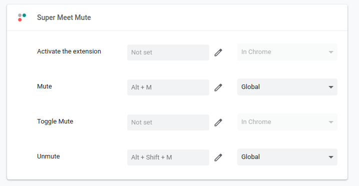

<h1 align="center">Super Meet Mute</h1>
<h3 align="center">A Google Chrome extension that makes it easy to mute/unmute Google Meet tabs, from <a href="https://github.com/mattsimonis">mattsimonis</a>, updated by <a href="https://github.com/AdrianPal">AdrianPal</a>, then again forked by <a href="https://github.com/erdii">erdii</a>.</h3>

## Installation

**This fork is not in the chrome webstore!**
To install, you can:
- clone the repo
- open [chrome://extensions/](chrome://extensions/)
- enable `Developer mode`
- click on `Load unpacked` and select the `ext` folder from our repo clone

## Configuration

Open [chrome://extensions/shortcuts](chrome://extensions/shortcuts) from the Google Chrome application, and define shortcuts to mute/unmute/toggle the microphone.

## Known Issues

- mute toggling is not synced between tab (which can be abused to toggle between being muted in two different meetings though)
